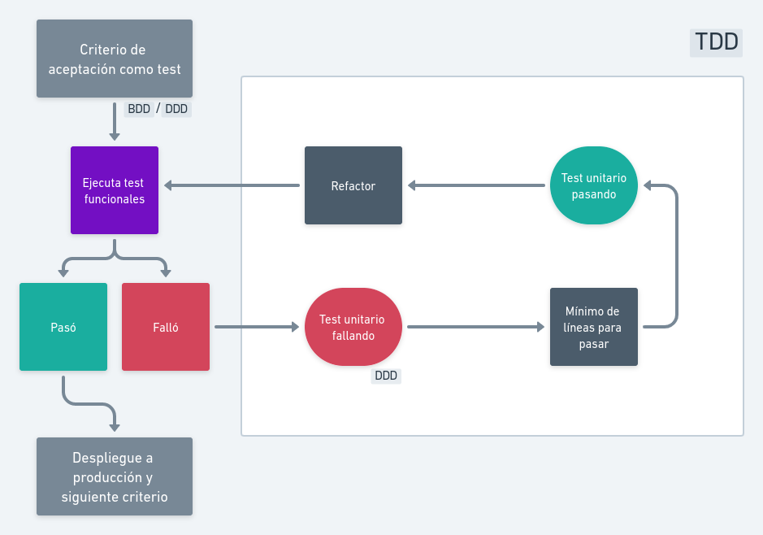
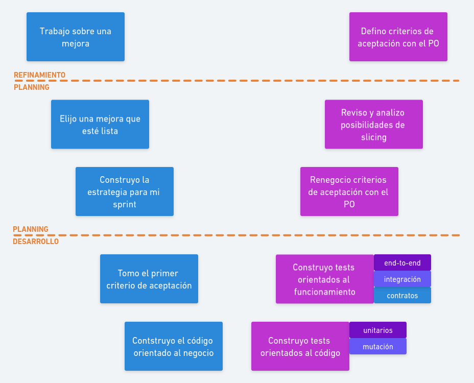

Paseando un poco en Google, es muy fácil encontrar una tremenda cantidad de Gurús que prometen
mejorar tu forma de desarrollar. Lo más probable es que existan tantas estrategias como personas en el planeta, y que cada uno deba experimentar hasta encontrar la propia.

En este artículo explicaré cómo podrían utilizarse `BDD` y `DDD` en conjunto con `TDD`. Puede ponerse medio arenoso el camino
y no está fácil encontrar el nivel de detalle/profundidad
que debiera darle a cada arista, veamos qué sale.

<!--truncate-->

## ¿BEDEQUÉ?

Para comenzar, vamos a repasar rápidamente en qué consisten estas maravillosas siglas. Tres metodologías:

### [Test Driven Development (TDD) - 2003](https://en.wikipedia.org/wiki/Test-driven_development)

[Kent Beck](https://www.kentbeck.com) nos propone un flujo de trabajo guiado por los test. Comienzas con un test, te aseguras
de que falle (🔴); escribes el mínimo de líneas de código necesario para satisfacerlo, te aseguras de que ahora el test pase (🟢);
y luego te preguntas cómo puedo ordenar/organizar/abstraer mejor la solución (refactor 👨‍🏭). Es un método incremental que pretende
mejorar tus resultados obligándote a poner el objetivo (test) por delante de tus ganas de lanzarte a escribir código.

### [Domain Driven Design (DDD) - 2004](https://www.amazon.com/-/es/Eric-Evans/dp/0321125215)

Erik Evans, por su lado, propone dejar el dominio al centro y crear un lenguaje común entre el software y el negocio que permita modelar
mejor los problemas y fomente la colaboración entre los distintos actores
([ubiquitous language](https://martinfowler.com/bliki/UbiquitousLanguage.html)), derribando las barreras entre lo técnico
y lo no-técnico. La idea es mejorar la comunicación para poder alinear objetivos, flexibilizar, mejorar la calidad del código y
orientarlo siempre al negocio.

### [Behaviour Driven Development (BDD) - 2011](https://www.amazon.com/RSpec-Book-Behaviour-Development-Cucumber/dp/1934356379)

[Dan North](https://dannorth.net) en respuesta a TDD, propone que manteniendo sus principios, agreguemos una capa superior que
permita diseñar la solución en base al comportamiento que un usuario debiera experimentar al interactuar con ella. Los objetivos
estarían definidos en términos de estas expectativas que el usuario tendría y se acordarían con el Product Owner (PO) como criterios
de aceptación. Para especificar estos acuerdos, propone el uso de `functional specifications` que vendría siendo un documento
que describe escenarios, ejemplos y casos de uso; todo potencialmente automatizable. Tal como en `TDD`, pero de alto nivel: 🟥, 🟩 y 👨‍🏭. Postula que la colaboración entre el usuario
y el equipo de desarrollo mejoraría la definición de lo que hay que desarrollar, su scope y la calidad del resultado.

Cada una de ellas tiene bastante literatura y teoría, da para estudiarlas un buen rato. En este artículo no profundizaré
muchísimo más en cada una, pero sí te lo recomiendo encarecidamente.

## Cómo combinarlos

Ahora vamos a lo bueno.

### Previo al desarrollo: refinamiento

En nuestro [backlog](https://scrumguides.org/scrum-guide.html#product-backlog) hay muchos potenciales incrementos,
cada uno de ellos consiste en una idea de mejora del software.
El equipo de desarrollo toma cada una de estas ideas y las _procesa_ aplicando la `DOR`
([Definition of Ready](https://www.scruminc.com/definition-of-ready/)), a este proceso lo conocemos como
[refinamiento](https://less.works/less/framework/product-backlog-refinement).

El producto del refinamiento, además del diseño de una solución, será una
definición de la historia de
usuario, la forma en que se podrá medir el incremento y acordaremos con el PO los criterios de aceptación aplicando estrategias de `BDD` y `DDD`.
Estos últimos, si
bien inicialmente solo estarán enunciados, debieran ser potencialmente programables como un test automatizado.

#### BDD

Comenzamos a comprender el problema desde la perspectiva del usuario.

:::tip Preguntas guías / BDD

- ¿Quién es el usuario?
- ¿Quién de mi equipo u organización lo conoce de cerca?
- ¿Qué información cuanti/cualitativa tengo o puedo conseguir acerca de su problemática?
- ¿Puedo conversar con alguien que represente personalmente a ese usuario?
- ¿En qué escenarios o situaciones el usuario tiene la problemática?
- ¿Qué expectativas tiene?
- ¿Cómo puedo satisfacer esas expectativas?

:::

#### DDD

Luego analizo cómo el negocio / organización responde o debiera responder ante esta necesidad del usuario. Es
probable que alguna de estas situaciones ya estén siendo atendidas o que la organización tenga algunas particularidades relevantes a tener en cuenta.

:::tip Preguntas guías / DDD

- ¿Conversé con todos los actores de mi organización que han enfrentado este problema antes?
- ¿Analicé cómo lo resolvían?
- ¿Diseñé un proceso para atender la necesidad? ¿Lo conversé con los otros actores de mi organización?
- ¿Qué reglas de negocio, normativas o regulaciones debiera tener en cuenta?
- ¿Existe algún algoritmo o lógica complicada que sea relevante?
- ¿Qué objetos de valor o entidades estoy enriqueciendo o
modificando con este incremento?
- ¿Qué desarrolladores/equipos tienen o deberían tener relación con esta historia?
- ¿Consideré en mi solución procesos de negocio o acuerdos estándares de mi organización (auditoría, por ejemplo)?
- ¿Consideré la continuidad operacional del negocio? ¿Cómo mi solución impacta en el negocio?

:::

`BDD` y `DDD` nos ayudan a definir criterios de aceptación con foco en el objetivo (__outcome__).

### Planning

Durante la [__planning__](https://less.works/less/framework/sprint-planning-one),
cada equipo elige un incremento que esté _listo_, para estos efectos:
que al menos haya pasado por el proceso de refinamiento y cuente con
criterios de aceptación ya acordados con el PO.

Si bien buena parte del trabajo debiera venir avanzado, ahora
revisaré y, si es necesario, dudaré de lo acordado. Intentaré aplicar
_slicing_ (cortar el incremendo en incrementos más pequeños) y re-negociaré
con el PO potenciales cambios o mejoras sobre los criterios de aceptación.

En este momento, también, el equipo diseñará una estrategia para el
sprint: cómo dosificar la entrega del valor. Conseguir que el _delivery/release_ sea cotidiano le quitará el riesgo a mi sprint y bajará la
ansiedad de __La Gran Entrega__ justo antes de la _review_.

### Desarrollo

Una vez que, como equipo, elegimos un item del backlog y planificamos el _sprint_: comienza el desarrollo.

#### Criterios de aceptación como test

Organizaré los criterios de aceptación de forma secuencial, suponiendo que
existe cierta linealidad en ellos. Los agruparé en pequeños _releases_
(funcionalidades que puedo sacar a producción). Tomaré el primero de ellos.

Comenzaré mi desarrollo con dos piezas claves:

- Programaré los criterios de aceptación como [tests orientados al funcionamiento](blog/testing-101/#a-orientados-al-funcionamiento-black-box) [`BDD` y `TDD`, test fallando (🟥)]
- Configuraré y desplegaré [feature-toggles](https://en.wikipedia.org/wiki/Feature_toggle) necesarios para que mi incremento pueda vivir en producción
sin entorpecer el funcionamiento del resto del software

#### Programación

¡Ahora a programar!, usaré `DDD` y `TDD` para definir pequeñas funcionalidades: escribiré un test unitario (🔴), las líneas de código que lo satisfagan (🟢) y el refactor (👨‍🏭).

Seguiré programando test unitarios hasta conseguir que los test asociadas a mis criterios de aceptación pasen (`BDD`, 🟩) y en ese momento, tengo mi primer incremento listo para ser desplegado en producción.

### Rinse & Repeat

Este proceso incremental se repetirá, intentando concentrar
estratégicamente el valor de la historia en los primeros
releases y, dejando para el final las mejoras que el
equipo hayan decidido hacer por sobre los criterios acordados con el PO.

## Recapitulando

Como ya habrán podido ver, cada paso de nuestro flujo de trabajo tiene una pincelada importante de estas estrategias.

Algunas ideas para cerrar:

- DDD nos entrega la perspectiva del negocio, la visión global, la estructura del dominio y la capacidad para abordar problemas técnicos de forma consistente
- BDD, la perspectiva del usuario. El permanente recordatorio de que tenemos que entender un problema real que aqueja a una persona
- TDD, nos entrega herramientas para crear casos de prueba previo al desarrollo y ayuda a siempre mantener el foco

Conseguir desarrollar este ciclo con maestría puede tomar mucho tiempo, requiere disciplina, tenacidad, paciencia y, sobre todo, repetición. Mucha repetición.

## Recursos

- [Test Driven Development: By Example / Kent Beck / 2000](https://www.amazon.com/-/es/gp/product/B095SQ9WP4/)
- [Reference - Domain-Driven Design / Eric Evans / 2015](https://www.domainlanguage.com/wp-content/uploads/2016/05/DDD_Reference_2015-03.pdf)
- [Introducing BDD / Dan North / 2006](https://dannorth.net/introducing-bdd/)

