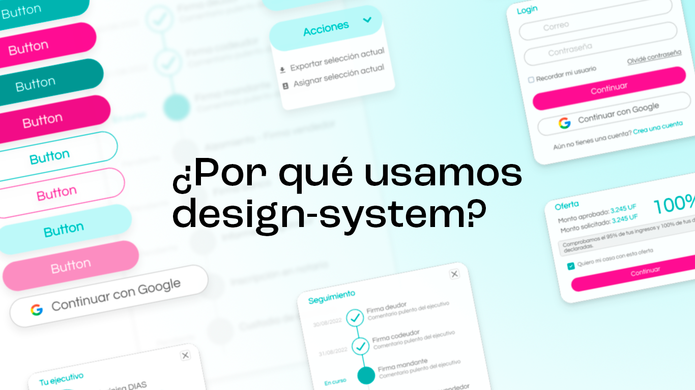
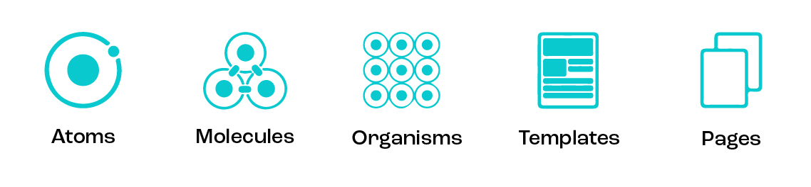
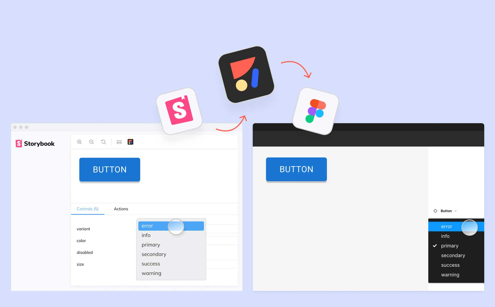

¿Qué es un design-system? ¿Por qué se vuelve relevante para Lendaas? ¿Cómo se implementa con nuestra metodología?
<!--truncate-->

## ¿Qué es un design-system?

El **design-system** es una infraestructura que nos permite garantizar la unidad y calidad de nuestro diseño. Se trata de una librería de componentes gráficos que se usan en todas las interfaces de nuestras aplicaciones.
Los componentes publicados en esta librería pueden ser exportados y usados en todos nuestros proyectos front. Los podemos usar tanto para prototipos en Figma cómo componentes en nuestro código.

:::info Atomic-design
El design-system es nuestra única fuente de la verdad en cuanto a diseño. Se basa en el concepto de atomic-design, es decir un sistema de diseño escalable que parte de lo más chico (atomos) a lo más grande (Páginas).

*Para saber más sobre atomic-design: <https://bradfrost.com/blog/post/atomic-web-design/>*
:::

## ¿Por qué se vuelve relevante para Lendaas?

En Lendaas trabajamos más de 30 desarrolladores en distintas partes de nuestras aplicaciones. Con un número de personas tan importante, resguardar la calidad del diseño y evitar código duplicado se vuelve un desafío muy complejo.

:::danger Problemas al no usar un design-system

- Componentes duplicados en varios lados del código.
- Componentes cumpliendo funcionalidades similares pero con diseños distintos, afectando la imagen de la marca.
- Actualizar/refactorizar componentes se vuelve muy engorroso.
- No todos nuestros desarrolladores tienen habilidades para diseñar o quieren pasar mucho tiempo en ello.
:::

El design-system permite tener un lugar común para todos los desarrolladores, mejora la comunicación e incrementa significativamente la velocidad de desorrollo. Nuestro producto se vuelve más escalable y consistente, podemos dedicar más tiempo a perfeccionar la experiencia de usuario.

## ¿Cómo se implementa con nuestro proceso de diseño?

En Lendaas no tenemos equipos dedicados unicamente al diseño. Consideramos que cada desarrolador es responsable de la mantención y construcción de nuestro design-system.

Parte de nuestros acuerdos en Lendaas es preparar prototipos navegables de nuestras interfaces que podamos testear con nuestros clientes antes de comenzar cualquier desarrollo.

Nuestro tooling de diseño contempla 2 herramientas complementarias: **Figma** y **Storybook**.

:::tip Metodología de diseño

- Creamos todos los componentes nuevos con todas sus variables primero en el código.
- Exportamos los componentes que se hayan creados a Figma. Figma propone una integración directa con Storybook. Puedes leer más al respecto por [acá](https://help.figma.com/hc/en-us/articles/360045003494-Storybook-and-Figma).
- Diseñamos los prototipos navegables en Figma y se desarollan usando el mismo design-system.

:::

## Recapitulando

- Un design-system es fundamental para resguardar consistencia y calidad del diseño/código.
- Mejora la eficiencia de los equipos y disminuya fricciones que tengan que ver con el diseño.
- Se integra en todas las etapas de construcción de una experiencia de usuario.

Los costos de implementación de un design-system pueden ser algo duros al principio. Requiere bastante trabajo previo, acuerdos de equipo y disciplina. Aún asi los beneficios a largo plazo deberían ser importantes.
