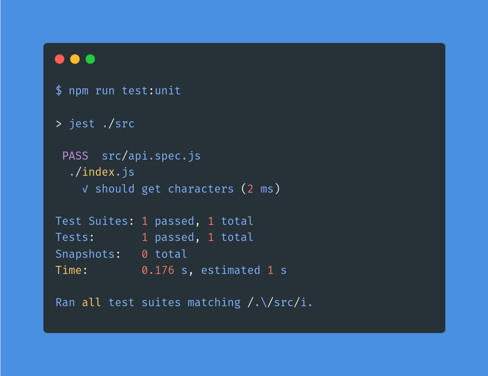
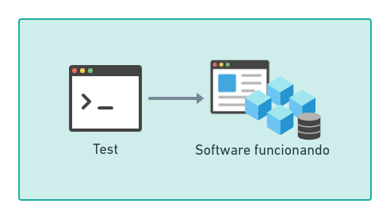
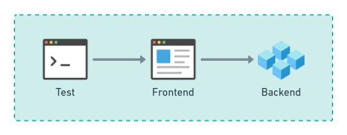
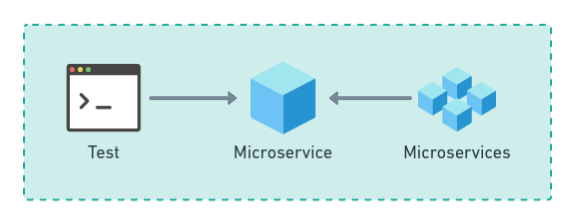
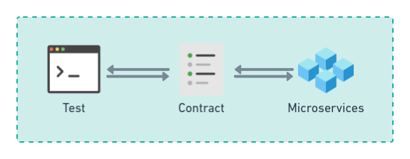
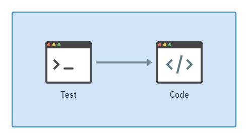
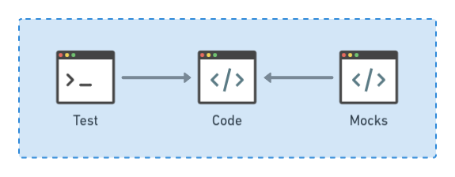
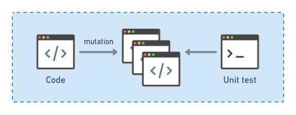

Qué entendemos por `testing` y por qué es parte de nuestra cultura.

<!--truncate-->

## Qué es 🤨

Entendemos por `testing` o `software testing` a la coordinación de estrategias que nos permiten asegurar que el software hace lo queremos que haga (o no hace lo que no queremos).

## Por qué testeamos 🤔

Los `test` al servicio del diseño de software son una poderosa herramienta para orientar nuestro desarrollo al objetivo que persigue: crear una funcionalidad,
ofrecer cierto beneficio a un cliente, dar cumplimiento a una normativa o comportarse de cierta forma ante condiciones específicas.

Contar con la capacidad de escribir un caso de prueba nos obliga a hacernos una serie de preguntas relevantes antes de empezar a escribir código productivo,
reduce errores y mantiene el foco en el cliente/negocio.

Además, nos permite:

- Darle al desarrollador y/o al equipo de desarrollo confianza para desplegar el software
- Transparentar al resto del equipo qué es lo que esperamos que haga el software [documentación]
- Permitir a otros modificar código descansando en los test como red de seguridad
- Reducir el número de incidencias en producción
- Ofrece retroalimentación rápida al desarrollador acerca del proceso mismo de desarrollar
- Contar con una estrategia sólida de CI/CD (integración y despliegue continuo)
- Dar cuenta de que se da cumplimiento a nuestros acuerdos técnicos

## BDD & DDD + TDD = ⭐

Son estrategias que nos ayudan a conceptualizar mejor la forma en que orientamos el desarrollo del software.

Desarrollo basado/guiado/orientado/dirigido por...

- `TDD` → `Test driven development`, test / pruebas
- `BDD` → `Beheivior driven development`, comportamiento
- `DDD` → `Domain driven design`, dominio

Si bien son acercamientos conceptuales, de alto nivel, conseguir combinarlas optimiza el proceso de ensayo/error y mejora continua
que ocurre (o debiera ocurrir) naturalmente cuando desarrollamos.

[Aquí](./tdd-bdd-ddd) puedes leer más acerca de cómo abordar estas estrategias conjuntamente.

## Tipos de test 🧰

### A. Orientados al funcionamiento (`black-box`)

Son test que se ejecutan sin conocer la implementación de la solución, solo saben lo que debiera o no hacer el software en una situación particular. Suelen utilizarse para validar el funcionamiento, pero también pueden implementarse para validar parámetros globales, tipos de respuesta, estándares de respuesta, etc.

#### A.1. End-to-End

Emulan la interacción de un usuario final a través de todas las capas del software funcionando.

:::info Consideraciones

- Requieren una comprensión profunda de los casos de uso y las necesidades del usuario
- Si bien aparentan ser simples, orquestarlas no suele ser sencillo
- Son más lentas que otros tipos de test

:::

#### A.2. Integración

Prueban el funcionamiento de uno o más servicios en forma simultánea.

:::info Consideraciones

- Son muy importantes cuando se utiliza arquitectura distribuida
- Hay bugs que aparecen a este nivel que no vamos a ser capaces de detectar con test unitarios
- Al igual que los `end-to-end`, configurar este tipo de pruebas requieren comprender la arquitectura
- Si bien no simulan la interacción de un usuario, los casos de prueba sí debieran pretender verosimilitud

:::

#### A.3. Contratos

Prueban los valores de entrada y salida los servicios.

:::info Consideraciones

- Se vuelven interesantes al trabajar con arquitectura distribuida
- Permiten probar que las interfaces de entrada y salida de dos o más servicios continuan siendo compatibles

:::

### B. Orientados al código (`white-box`)

Al contrario de los anteriores, estos test sí pueden pueden acceder al código mismo, a la implementación de la solución.

#### B.1. Unitarios

Prueban unidades de código en forma aislada. Nos permiten asegurar que nuestras líneas de código hacen lo que esperamos que hagan quitando de la ecuación a las dependencias.

:::info Consideraciones

- Si existen dependencias, solemos usar un sustituto (`mock`) que permita sacar adelante el test
- Si un mock es complicado, probablemente la solución no es tan buena: opoturnidad para mejorar responsabilidad/modularización del código
- Son útiles para refactorizar functiones/métodos/clases largas
- Requieren conocer tanto el framework utilizado como la herramienta que ejecuta los tests
- Son tratados con el mismo cariño que el código productivo
- Pro tip: probar la solución, lo que el código debiera hacer y no la implementación

:::

#### B.2. Mutación

Toman el código fuente y lo modifican, a cada modificación la llaman `mutante`, luego ejecutan la suite de test unitarios contra cada mutante. Si el test pasa, el mutante muere. Mientras menor sea la cantidad de mutantes sobrevivientes, mayor será la calidad de los test unitarios.

Su objetivo es ayudarnos a mejorar la calidad del código y de sus test unitarios.

:::info Consideraciones

- A veces no es tan fácil comprender su funcionamiento
- Es muy recomendable utilizarlos en dominios que requieran un trabajo detallista y orientado a casos de uso de alta especificidad
- A veces no son tan efectivos: solemos depositar en capas del software medidas de seguridad que nos permiten deliberadamente no manejar algunos casos bordes y comprobaciones dentro del mismo software

:::

## Referencias

- [Effective Software Testing / Maurício Aniche](https://livebook.manning.com/book/effective-software-testing/welcome/v-4/)
- [Test that find bugs / Software Engineering Unlocked](https://www.software-engineering-unlocked.com/tests-find-bugs/)
- [A guide to unit testing in JavaScript / Marc Mignonsin](https://github.com/mawrkus/js-unit-testing-guide)
- [Jest Docs](https://jestjs.io/docs/getting-started)
- [Testable JavaScript / Mark Ethan Trostler](https://www.oreilly.com/library/view/testable-javascript/9781449323516/ch04.html)
- [The Practical Test Pyramid / Ham Vocke ft. Martin Fowler](https://martinfowler.com/articles/practical-test-pyramid.html)
- [Clean Code / Robert Martin](https://www.amazon.com/Clean-Code-Handbook-Software-Craftsmanship/dp/0132350882) ([en pdf](https://enos.itcollege.ee/~jpoial/oop/naited/Clean%20Code.pdf))
