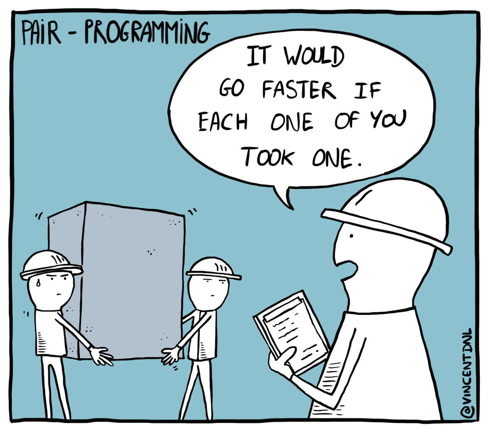
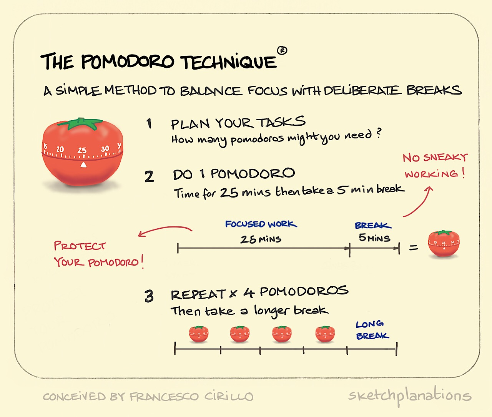

Programar entre dos no es tan difícil como parece. Aquí algunas ideas para ponerlo en práctica.

<!--truncate-->

## Qué es 👯‍♂️

Como su nombre lo dice: es una estrategia para escribir código entre dos personas.

## Roles 👩‍✈️

Dos personas, dos roles:

- **Piloto / driver:** es quien tiene las manos en el
timón (teclado). Solo él ejecuta los cambios en el código. Si
la sesión es remota, comparte pantalla.
- **Co-piloto / navigator:** compañero de ruta, si bien
no está escribiendo código, sigue el proceso, suguiere,
comenta, debate. Su responsabilidad es mirar el mapa,
tener los ojos en la documentación, referentes, esquemas, acuerdos y simpre en el paso siguiente.

Los roles se van intercambiando en cada bloque a lo largo de la sesión.

## Pomodoro 🍅

Es una técnica para manejar foco en bloques cortos, su mecánica es simple:

- Elige una tarea que estimen tome no más de 20 minutos
- Si no existe esa tarea: divide, muele, lilúa, pica... hasta conseguirla
- tarea (SMART): específica, medible, asignable, realista, acotada en el tiempo
- Asígnate la tarea en el artefacto que el equipo utilice para eso (Trello?)
- Trabaja en la tarea por 25 minutos
- Descanso de 5 minutos
- Cambio de roles y repetir
- Luego de cuatro o cinco bloques, el descanso será de 20 minutos

:::info OJO

Pomodoro no es escrictamente necesario para programar entre pares, pero parece ser un
marco de trabajo que da buenos resultados. Pueden probar
una estrategia distinta, mi recomendación es que la definan,
la dejen por escrito, la respeten y ojalá la evalúen al final de la sesión.

:::

## Cómo funciona 🥷

- El copiloto inicia el cronómetro, la alarma tiene sonar cuando sea que se cumpla el tiempo acordado
- Ambos conversan, debaten, discuten acerca de qué / cómo hacer para sacar adelante la tarea
- Hallazgos: tratar de mantener el foco. Stopers o potenciales amenazas, anotarlas para atenderlas luego de terminada la tarea del bloque
- Toda duda es legítima, aunque tome tiempo y haya que repetir
- Suena la campana: cambio
- Si alguien necesita una pausa corta: se toma [ambos paran, se detiene el tiempo]
- Si la pausa es larga, dejar el trabajo hasta donde esté y volver a retomar apenas sea posible (o repensar la estrategia)
- Si es necesario relativizar la duración de cada sesión, adelante [ojalá no pase de 1,5 hrs.]
- Lo ideal es conseguir que al finalizar el bloque, la tarea quede lista

:::tip Nota
Clonar repositorios, cambiarse de rama, levantar contenedores docker... preparar ambiente local, idealmente debiera ocurrir previo a la sesión.
Si necesitas ayuda, pídela y luego de conseguirlo, que comience la sesión.
:::

:::info OJO
Dejé un link en las referencias sobre _strong-style pairing_, una
variante donde el _driver_ solo escribe lo que el _navigator_ le
dice que escriba. Puede resultar interesante, lectura
recomendada.
:::

## Ventajas 👍

- Evita quedarse pegado en cosas chicas
- Fomenta el aprendizaje e interacción entre pares
- Code review implícito, menor retrabajo
- Aliviana el trabajo inter-equipo y refuerza el aprendizaje de nuevos integrantes
- Más foco
- Obliga a avanzar en base a acuerdos
- Aumenta la calidad del código (dos cabezas piensan mejor que una)

## Desventajas 👎

- Puede ser cansador, intenso
- Puede ser invasivo (si alguien no quiere/puede, no debería ser un problema)
- Quedarse pegado en algo puede ser frustrante, sobre todo cuando no hay un acuerdo claro
- En términos de eficiencia y costo, puede parecer más ineficiente y caro que trabajar por separado (muy debatible y digno de análisis, pero es un punto a tener en consideración)

## Herramientas 🎒

- Google Meet, oh sí
- CoScreen: www.coscreen.co
- CodeTogether: www.codetogether.com
- Replit: www.replit.com (requiere login para compartir en vivo)
- Live Share: <https://visualstudio.microsoft.com/services/live-share/>
- Live Share en el Browser: <https://docs.microsoft.com/en-us/visualstudio/liveshare/quickstart/browser-join>

:::tip Bonus track

- Al finalizar un día de mucho pair-programming, entregar feedback acerca de la experiencia
- Analizar qué funcionó, qué podría funcionar mejor y cómo
- Qué hizo muy bien el otro, qué podría hacer mejor
- Ejemplos:
  - Hiciste buenas preguntas
  - Podríamos haber rotado más
  - Mantuviste el foco a pesar de...
  - etc
- Si quieres saber más acerca de cómo retroalimentar, visita la sección de [Retroalimentación entre Pares](/peer-feedback)

:::

## Referencias 📚

- [Martin Fowler - Pair Programming](https://martinfowler.com/articles/on-pair-programming.html)
- [Recurse Center](https://www.recurse.com/manual#sec-pairing)
- [Llewellyn Falco - Llewellyn’s strong-style pairing](http://llewellynfalco.blogspot.com/2014/06/llewellyns-strong-style-pairing.html)
- [CoScreen - Pair programming tag](https://www.coscreen.co/blog/tag/pair-programming/)
