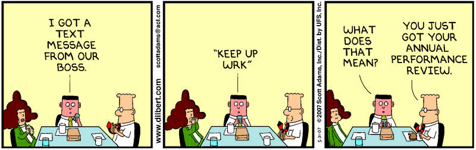

<!--truncate-->

## Por qué retroalimentar 🤗

- Mejora la confianza y el clima de trabajo
- Potencia el crecimiento personal y profesional
- Da a conocer a otros las expectativas que tengo ellos y puedo conocer las que otros tienen de mí

## Reglas del juego 🎲

- Agendar con al menos una semana de anticipación, no más de 1 ~ 1,5 hrs.
- Preparar responsablemente la reunión para que la retroalimentación sea significativa y no improvisada
- Idealmente presencial (lugar relajado, fuera de la oficina) y siempre uno a uno
- Confidencial y no vinculado con evaluación formal de desempeño
- Recíproco, ambos retroalimentan
- Ojalá hacer el ejercicio periódicamente, tres o cuatro veces al año
- No necesariamente tiene que ser con el equipo/célula de trabajo cotidiano, funciona igual con personas de otros equipos o áreas

## Cómo retroalimentar 🦸

Conversación en base a tres preguntas guías, con énfasis general en cómo puedo ayudar al otro a ser mejor en su trabajo.

1. Qué creo que hace MUY bien
2. Qué creo que no hace tan bien y cómo creo que podría mejorar
3. Qué creo que hace bien, pero creo que podría hacer aún mejor y cómo

:::tip Nota
Para más información, googlear: sandwich / hamburger feedback method.
:::

## Tips 💡

- Aludir a situaciones específicas y concretas dando ejemplos, ojalá más de uno
- Tomar una actitud de apertura, tanto al retroalimentar como al recibir retroalimentación
- Ofrecer un punto de vista personal y constructivo e intentar encontrar valor en ese mismo gesto que te ofrece el otro
- Enfatizar que es personal y subjetivo: siento / veo / percibo que…
- Mantener el foco en la estructura de la sesión y las preguntas guías
