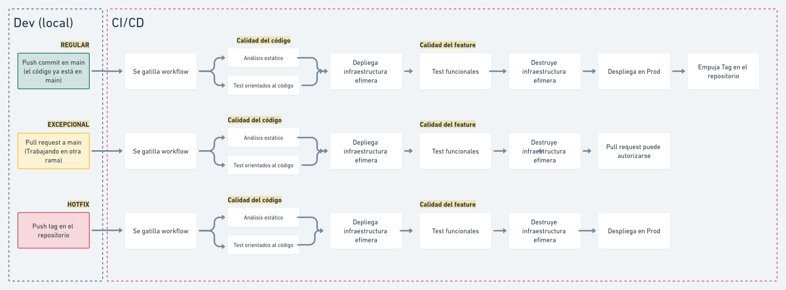

Definir cómo desarrollar es complejo. Se intersectan temas de cultura organizacional,
framework de trabajo, acuerdos de equipo, acuerdos técnicos y, si le agregas automatización,
unas cuantas líneas de código.

Dejamos algunas reflexiones y cabezazos que nos hemos dados con este tema.

<!-- truncate -->

## Como solíamos trabajar

### Feature branching + Drone

El flujo de trabajo que conocemos sería más o menos así:

- Creo una rama a partir de la rama principal del repositorio
- Diseño mis test y las mejoras que quiero hacer en el código
- Creo un _merge request_, en ese momento se gatilla un _pipeline_ en
el Drone que asegura calidad: audita, ejecuta _linters_ y tests
- Si pasé exitosamente por el proceso de aseguramiento de calidad, habilita
la opción para que sea posible _mergear_ a la rama principal
- Ejecuto el _merge_ y ahora el nuevo código es parte de la rama principal
- Al empujar un _tag_ en el repositorio, se gatilla un nuevo _pipeline_ que,
además de asegurar calidad, despliega la nueva versión del software en
producción

Desde este lugar comienza nuestro viaje y sobre esta base comienza nuestra conversación.

### Pros

- Drone cuenta con una muy linda y amigable interfaz
- Más vale diablo conocido que diablo por conocer, ...dicen
- Nuestra implementación de Drone, si bien utiliza las herramientas provistas
por [Harness](https://harness.io) y la comunidad (`Drone Server`, `Drone Runner`,
`Drone Autoscaler`, `Drone CLI`, etc), nos da mucha libertad al momento de personalizar
la experiencia

### Contras

- No permite reutilizar variables en los _pipelines_
- Tiene pocas herramientas para optimizar las tareas que se ejecutan (fuera de crear imágenes docker)
- De acuerdo a la licencia del mismo Drone, ya estamos fuera de la
Community Edition. Si decidiéramos quedarnos con esta herramienta, correspondería
pagarla
- El flujo de trabajo supone la existencia de ramas y fricciona bastante el desarrollo,
obligándonos a crear diferentes versiones del código y exponiéndonos a potenciales
conflictos
- Para llegar a producción, tenemos que pasar dos veces por el proceso de aseguramiento de calidad
- Dado que los runners están desplegados por nosotros en nuestra nube de AWS, decidimos implementar
el `Drone Autoscaler`, que ofrece la posibilidad de arrancar nuevas máquinas en la medida que son
necesarias. El tiempo que se toma Drone en desplegar máquinas y luego ejecutar el _pipeline_ en algunos
casos sobrepasaba los 10 minutos, estimamos que es demasiado

### Por qué queremos cambiar

Si bien nuestro flujo de trabajo es bastante natural y fluido, creemos que podemos llevarlo al siguiente
nivel. Además, si bien el Drone tiene muchas bondades, sus limitaciones nos están pesando un poco.

## Feature toggles: Despliegue !== Release

Nuestro flujo de trabajo contempla el despliegue frecuente a producción
pero esto no siempre quiere decir que la funcionalidad está disponible
para ser utilizada.

El release, el momento en que se libera la funcionalidad a los usuarios,
está asociado a nuestros _feature toggles_ y la forma en que estos son
liberados para su uso puede variar de acuerdo a decisiones de negocio. Un
cliente puede contar con una funcionalidad y otro, no; un usuario puede
tener acceso a una funcionalidad que está en proceso de desarrollo; un país
puede contar con una funcionalidad que otro país no; y así.

Esto implica que tenemos que acostumbrarnos a la idea de que en nuestro
software productivo conviven funcionalidades que están disponibles con otras
que no lo están. Tienen en común que todas deben cumplir con nuestro estándar de trabajo,
acuerdos de equipo y contar con test automatizados que nos dan la tranquilidad
de que, cuando estén activos, funcionarán correctamente.

## Flujos de trabajo ideal

Luego de reflexionar, acordamos agregar más posibilidades para que el proceso
de desarrollo sea más corto: eliminar la necesidad de contar con una rama
y poder trabajar directamente con la rama principal de cada repositorio.

Diseñamos tres alternativas:

- Al empujar cambios en la rama principal, nuestro sistema de integración/despliegue continuo
tomará esa versión del código, asegurará calidad y desplegará en producción
- Al crear un _merge request_, solo asegurará calidad
- Al empujar un _tag_ que incluya la palabra `hotfix`, tomará esos cambios, los someterá al
proceso de aseguramiento de calidad y desplegará los cambios en producción

Queremos que el primero de los escenarios sea el más común, pero sabemos que existen algunas
situaciones en las que una rama será el camino, por eso mantendremos el segundo flujo de trabajo.

El tercero es para situaciones aún más excepcionales, en las que por algún _bug_ sea necesario
pasar por encima de la última versión del código que está en la rama principal y llegar a producción.

Ahora se nos viene un proceso de investigación que nos ayude a definir qué herramientas
queremos utilizar para automatizar este proceso. Ya les iremos contando.
