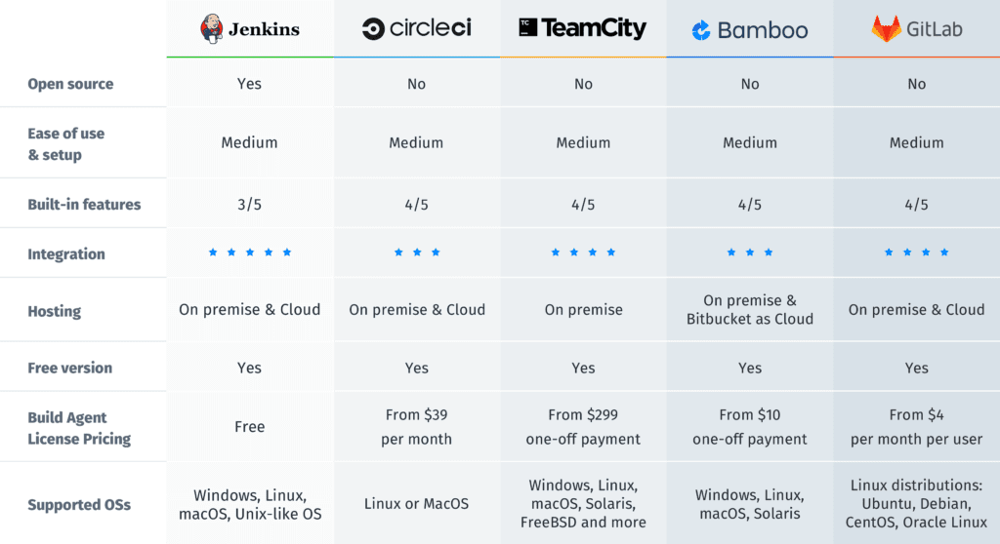

Durante las últimas semanas, decidimos trabajar en la ardua tarea de implementar un sistema de integración/despliegue continuo.

No ha sido un viaje libre de tropiezos, por aquí
les contamos el camino que recorrimos, las decisiones que fuimos tomando y a dónde llegamos.

<!-- truncate -->

## Qué es un sistema de integración/despliegue continuo

Más conocidas por sus siglas en inglés: Continuous Integration [CI] & Continuous Delivery [CD], son dos conceptos muy
relevantes para el desarrollo de software.

### Integración Continua (CI)

Es la práctica de integrar nuevas líneas de código de forma
(muy) frecuente a un repositorio compartido. Acortar el
tiempo que hay entre cada nuevo cambio del software
evita la posibilidad de conflictos y nos obliga a mantener un nivel de
comunicación estrecho entre los desarrolladores del equipo.

### Despliegue Continuo (CD)

Tradicionalmente cuando un desarrollador terminaba algo, continuaba con una larga
seguidilla de tareas que permitía dejar esa nueva mejora en producción. Este
proceso podía incluir cosas como: probar el código localmente, empaquetar
el código, autidarlo, desplegarlo en un ambiente pre-productivo, volver
a probarlo (manual y automatizadamente), pedir autorización a otros,
y, si vamos bien hasta ahí: desplegar en producción.

El despliegue continuo se encarga de automatizar todo lo anterior para
asegurar que los acuerdos técnicos se cumplan de manera estandarizada y
consigamos llegar a producción de la forma menos friccionada posible.

La premisa es: automatizar todo lo que sea automatizable.

### Sistema de integración/despliegue continuo

Por lo tanto un sistema de integración/delivery continuo es una serie de
acuerdos, formas de trabajar y herramientas que nos permiten automatizar
la forma en que nuestro código se transforma en una aplicación productiva.

## Por qué es importante

Es fundamental tener un proceso aceitado, claro y transparente para todos
por muchas razones, algunas de ellas:

- Trabajamos con el [Framework LeSS](https://www.less.works) y queremos
evitar a toda costa tener equipos a cargo de etapas de desarrollo (QA, DevOps, UX etc).
[Aquí](https://less.works/less/structure/teams#Donthavephase-basedresourceallocation)
puedes leer más acerca de las recomendaciones que tiene LeSS para sus equipos
- Queremos implementar `TDD` como parte de nuestro flujo de trabajo para, ojalá,
liberar pequeños incrementos diariamente. Contar con herramientas para que
nuestro equipo pueda ver ese test fallando (🔴) y que su código sea llevado
directo a producción apenas sea posible, es parte importante de la metodología
- Nos permite reducir nuestro CycleTime, medida importante de eficiencia para
nuestros equipos
- Asegurar que se ejecuten las suites de tests y que se respeten
los acuerdos técnicos del equipo
- Transparentar el historial completo de despliegues de nuestro software

## La búsqueda

Desde este lugar, comenzamos nuestra búsqueda.

<!-- markdownlint-disable-next-line MD033 -->

Tomado de: <a href="https://katalon.com/resources-center/blog/ci-cd-tools">Katalon / Best 14 CI/CD Tools You Must Know | Updated for 2022</a>

Para salir adelante con la implementación de este tipo de herramientas
no basta con leer artículos y ver videos, hay que lanzarse a probar hasta
dar con alguna solución que sea convincente.

### La promesa de AWS

Fue la primera opción que miramos seriamente, pensamos que era lógico que si usamos la nube de AWS
naturalmente podríamos usar su sistema de integración continua de forma nativa.

Cómo (parece que) funciona:

- A diferencia de nuestra experiencia con Drone, en AWS no existe la idea del `runner` (una máquina que
está disponible para ejecutar trabajos [_pipelines_]), sino que es necesario crear una serie de recursos
específicos que son orquestados en cada despliegue (`AWS Pipelines`, `AWS CodeBuild`, `AWS CodeDeploy`)
- La definición de los pasos que ejecuta el _pipeline_ viviría en estos recursos de AWS
- Dado que queremos que la definición del _stack_ viva en el mismo repositorio, desarrollamos los recursos
de AWS y los desplegamos usando el `CLI` de `SAM` y `CloudFormation`

Resultado:

- La interfaz del despliegue es tosca o no muy amigable
- El proceso es bastante más lento de lo que era en Drone
- Si bien el potencial que tiene la herramienta es tremendo (básicamente puedes orquestar cualquier
servicio de AWS durante el proceso de despliegue), nos resultó sumamente complicado y poco escalable
para una organización como la nuestra, donde son muchos los repositorios

Finalmente decidimos seguir buscando.

### CircleCi

#### Amor a primera vista

Desde que comenzamos, la experiencia fue interesante. Conseguimos integrarnos y probar muy rápidamente.
Ofrece la posibilidad de usar [Orbs](https://circleci.com/docs/orb-intro) que parecían simplificar bastante
la especificación de pasos recurrentes (y puedes crear los tuyos!).

#### Proof of Concept (POC)

Implementamos el siguiente flujo

- Al empujar en la rama principal arranca el pipeline
- Ejecuta análisis estático de código, revisa linters y test unitarios
- Despliega infraestructura en la cuenta personal de cada desarrollador
- Obtiene el output de la infraestructura creada y lo deja como variables de entorno
- Ejecuta test funcionales directamente contra la infraestructura que fue desplegada
- Independiente del resultado de los test funcionales, destruye la infraestructura
- Despliega en producción

#### Contratiempos

Conseguimos sacar adelante la POC, pero no sin problemas.

- No fue fácil manejar [contextos](https://circleci.com/docs/contexts) específicos
para manejar los secretos de cada desarrollador
(finalmente llegamos a una especie de solución/hack)
- La integración de CircleCI con GitLab dejaba bastante que desear, algunas variables de
entorno no existían, los filtros funcionaban erráticamente
- No podías entregarle el contexto con los secretos a varios de los orbs que provee
CircleCI, como nuestra intención era desplegar en distintos entornos finalmente
desistimos de usar algunos Orbs que se veían prometedores
- Los [anchors](https://circleci.com/docs/introduction-to-yaml-configurations#anchors-and-aliases)
si bien están documentados, no parecen funcionar siempre. Obligados a repetir líneas de código

#### Pros

- Permite modularizar lógica en pequeños scripts que viven fuera de la definición del template (`.sh` o `.js`)
- Es realmente rápido, tiene una muy buena gestión de contenedores pre-cargados e imágenes optimizadas
- Puedes entregarle los informes de los test y crea estadísticas muy interesantes acerca de su desempeño,
identifica `flaky test` (test erráticos) y entrega bastante información digerida para mejorar la estrategia
de testing
- Entrega muchos detalles acerca de la gestión de las máquinas que ejecutan los pipelines

### Buddy

Hicimos una prueba sencilla y nos quedamos con las ganas de probarlo en profundidad. La interfaz
se ve bastante buena y parece soportar bastantes servicios. Nos llamó la atención que ofrece un
asistente muy completo para crear tu pipeline en el navegador, pero no entrega inmediátamente
directrices para implementar tu pipeline desde el código. Quizá nos faltó tiempo.

## Conclusiones y aprendizajes

Finalmente decidimos quedarnos con GitHub + CircleCI.

Existen muchas más alternativas que no probamos, el panorama
es extenso y queda bastante por investigar en este tema. Por
ahora estamos satisfechos con el resultado.
