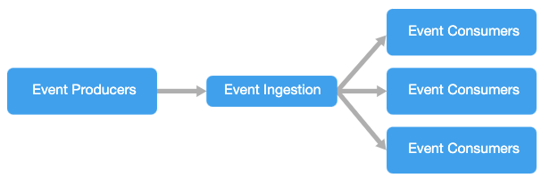
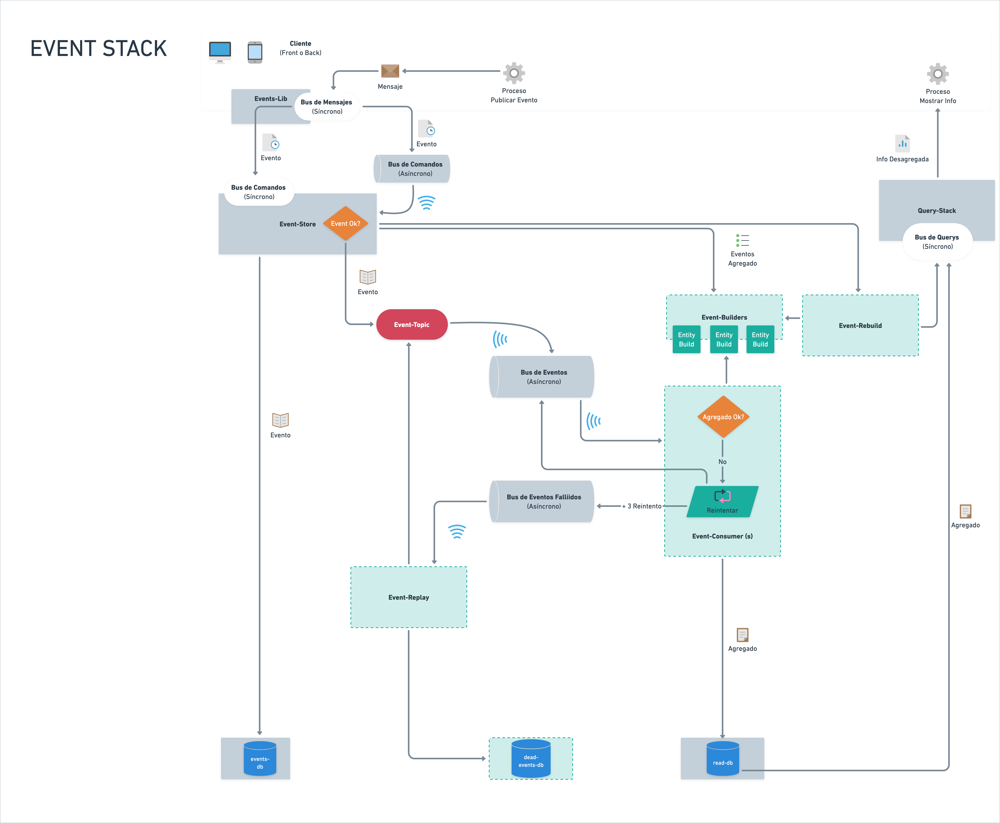

# Eventos

Qué son, en qué se basan y cómo se generan

## Qué es `Events`?

Toda interacción del usuario con el producto que sea de interés medir o trazar, es registrada a través de una funcionalidad que a efectos prácticos hemos denominado `Events`.
`Events`, tiene en si mismo una serie de componentes y bases de datos distinta a la transaccional.
El objetivo de esto, es que esta información permita ofrecer datos para analítica, desde un contexto distinto al transaccional, optimizando así la información para estos propósitos, sin poner sobrecarga innecesaria a la operación del producto.
Además, esto permite ofrecer información directamente desde esta base de datos a la operación, cuando es necesaria la explotación de estos datos con otros propósitos o por terceros, como por ejemplo reportería.



## En qué se basa el modelo `Events`?

`Events`, se basa fundamental - y parcialmente - en dos patrones de diseño orientados a eventos:

### CQRS

[Más info](https://martinfowler.com/bliki/CQRS.html)

`CQRS` es un patrón arquitectónico, significa segmentación o separación de responsabilidad de consulta (operaciones que recuperan información de datos en la aplicación) de comando (operaciones que modifican el estado de los datos en la aplicación).

- Separa la ejecución de acciones que modifican el estado de las entidades de negocio, de la generación de consultas.
- Alta escalabilidad al permitir distribuir la aplicación.
- Alta disponibilidad, busca que si se cae un componente la mayor parte de la aplicación siga funcionando.
- Permite la creación de modelos de lectura de datos desacoplados, optimizados para lecturas.

### Event Sourcing

[Más info](https://martinfowler.com/eaaDev/EventSourcing.html)

`Event Sourcing` es un patrón arquitectónico que garantiza que todos los cambios en el estado de la aplicación se almacenen como una secuencia de eventos, así consultar estos eventos, usar el registro de eventos para reconstruir estados pasados, y como base para ajustar el estado frente a los cambios retroactivos.

- Reducir tiempos de respuesta.
- Comunicacion asíncrona.
- Basado en eventos que contienen información valiosa para el negocio.
- No hay ni modificación, ni borrado (se ejecuta un comando que produce un cambio de estado y como consecuencia un evento)
- Auditoria / historial.
- Análisis de datos.

Estos dos patrones arquitectónicos unidos, generan un modelo de alta escalabilidad y rendimiento que permite gestionar gran cantidad de mensajes de forma simultánea, de forma asíncrona a la transaccionalidad, las que son características de relevancia que nos interesa aprovechar para esta funcionalidad.

:::note Diagrama de arquitectura `Events`

:::

:::warning Consistencia Fuerte vs. Consistencia Eventual
Uno de los temas controversiales en el uso de patrones orientados a eventos asíncronos, es la *consistencia eventual*, que en nuestro contexto significa que, una vez que se realiza una petición de publicar un evento, no podemos garantizar con certeza que fue procesado con éxito en un tiempo determinado.
Sólo podemos notificar al canal que recibimos la petición con la promesa de procesarlo eventualmente, y que en caso de falla, sus datos fueron guardados y podrá reprocesarse luego.

Esto marca una diferencia sustancial con modelos de *consistencia fuerte* (aquellos que esperan que el proceso culmine para notificarlo al canal), por la cantidad de elementos "autónomos" (microservicios, colas, bases de datos, consumidores, etc) que desencadenan sus procesos a medida que se van requiriendo.

Es necesario entender y asumir este trade-off como parte del modelo, en pos de los beneficios descritos anteriormente.
:::

## Cómo funciona `Events`?

`Events` tiene una serie de componentes que dan vida a un software orientado a eventos. Cada vez que ocurre una acción relevante en el sistema, como *crear un cliente*, *actualizar una transacción* o *eliminar un usuario*, podemos *publicar* un evento que de cuenta de esa *acción* sobre sus *entidades*.

:::note Componentes

`Events` se conforma principalmente de 6 tipos de componentes:

- Librería `events-lib`.
- Componente `event-store`.
- Componente(s) `events-consumer`.
- Componente(s) `query-stack`.
- Buses (síncronos u asíncronos) de mensajes, comandos, eventos y querys.
- Bases de datos relacional (eventos y modelos de lectura).

Otros componentes pueden ser añadidos o escalados al modelo en tanto no colisionen con el marco teórico.

:::

:::warning Uso de Base de Datos Relacional vs. DataLake
El uso de un DataLake que guarde o genere archivos de eventos, no responde a la necesidad especifica del modelo de eventos, que implica implementar CQRS + Event Sourcing, ya que requiere una alta disponibilidad de los eventos genéricos para su reconstrucción.

Por otro lado, se incrementarian los **costos en servicios AWS**:

Actualmente:

- Postgres RDS: 150$/Mes
- SQS/SNS: 1$/Mes

Adicionando DataLake:

- Glue: 10$/1M Registros + 1$/1M Consultas
- Athena: 1.5$/10GB/Consulta

Además, las **consultas contra eventos** estan indexados y las consutlas de mayor demanda estan en los modelos de lectura, que son mas acotados, por lo cual no se preveen problemas de rendimiento en la consulta de eventos.

### Storage

Para 1 cliente, la base de datos tiene un peso de 520MB con aproximadamente 3 millones de eventos en un año.
En la proyección para 3 clientes, se espera que la base de datos de eventos tenga un peso de 2GB, con 12 millones de eventos aproximadamente en un año.
De esto se concluye que las capacidades de RDS Postgres desplegadas son mas que suficientes para soportar la operación esperada.

:::

***Publicar* un evento**, implica llamar una función asíncrona (no esperamos respuesta de su ejecución) llamada *publish* y que vive en el componente *events-lib*. Esta función, envía un mensaje de tipo *evento*.
El objeto *evento* está compuesto por propiedades genéricas, que permiten soportar información de cualquier entidad y sus casos de uso. Esta flexbilidad, habilita la generación de eventos en cualquier parte del flujo, para cualquier caso que desee medirse, auditarse o informarse.

La publicación del evento, gatilla dos acciones específicas:

- Guardar el evento genérico en la base de datos de eventos, que denominamos la *fuente de la verdad* a través de la pieza de software *event-store*.
- Una vez que el evento es guardado con éxito en la base de datos, se envía el evento al *bus de eventos* asíncronos, dejandolo disponibles para ser procesados por *events-consumers* que a su vez, generan *modelos de lectura*.

Una vez que esto ocurre, la información del evento está disponible para ser consultada, ya sea a través de una pieza de software que procesa *querys* o peticiones de datos llamado *query-stack*, o por terceros que forman parte del producto.

:::tip Glosario de términos
Derivado de lo anterior, aclaremos algunos conceptos:

- **Bus**: es un canal de comunicación síncrono o asíncrono, que permite enviar peticiones de procesamiento de datos. Existen varios tipos de buses en este modelo: de mensajes, de comandos, de eventos o de querys.
- **Evento**: objeto genérico que da cuenta de la ocurrencia de una acción sobre una entidad en un momento específico en el tiempo.
- **Event-consumer**: pieza de software que se conecta a un bus de eventos para procesarlos con lógica de negocios y generar modelos de lectura de entidades y/o casos de uso.
- **Events-lib**: librería que dispone de la interfaz para publicar un evento. Funciona como bus de mensajes síncrono entre el canal y el event-store.
- **Event-store**: pieza de software que se conecta a un bus de mensajes, recibe estos mensajes, los procesa como eventos y se asegura de guardarlos en la fuente de la verdad. Además, los deja disponible en el bus de eventos.
- **Fuente de la verdad**: es un almacén de datos que recopila todos los eventos ocurridos en el sistema.
- **Modelo de lectura**: almacén de datos alimentado por eventos y que están orientados y optimizados a casos de uso de información específicas. Su información suele estar desagregada e indexada.
- **Query**: objeto que da cuenta de parámetros o filtros de consultas de datos para satisfacer una necesidad de información específica.
- **Query-stack**: pieza de sotware que se conecta a un bus de querys, recibe dichas querys, consulta los datos en modelos de lectura para satifacer sus parámetros y retorna la información resultante al canal.

:::

## Cómo se define un `Evento`?

Se espera que un `Evento` sea lo suficientemente flexible para soportar en forma genérica los distintos casos de usos y entidades que el modelo defina.

Sin embargo, se requiere de una estructura básica que permita su procesamiento. Nos basamos en el estándar  `Event Store` para esta definición.

:::note Objeto Evento

```json
{
  "type": "events",
  "attributes": {
    "aggregateId": "123456",
    "aggregateVersion": 1,
    "type": "creditu.simulation.1.event.simulation.created",
    "data": {
      "_id": "612840284af86262141bffd3",
      "occurredOn": "2022-01-01 20:34:55",
      "idNumber": "111111111-11",
      "approvedAmount": 585000,
    },
    "metadata": {
      "country": "BR",
      "origin": "SIMULATOR-BACKEND"
    }
  }
}
```

:::

A continuación, definimos cada campo:

### type (of message)

*Tipo de mensaje*. Para tener consistencia entre distintos tipos de mensajes que pueden ser publicados. Puede tener dos valores: `events` o `commands`.
:::note
En el alcance de analítica y reportería, sòlo implementaremos el tipo `events`, dejando el caso de `commands` para futuros desarrollos en los cuales se amerite.
:::

### attributes

Es un objeto que contiene los datos utiles para identificar el cambio de estado de la aplicación a través del evento. Entre los atributos estandarizados están:

#### aggregateId

*Identificador único del objeto agregado*. Por lo general, lo representa el Id único del objeto en la base de datos.

#### aggregateVersion

*Versión del agregado*. Útil para cambios eventuales en la estructura del evento y que ameriten un versionado. Por regla general, se entiende que el valor por defecto es `1`.

#### occurredOn

*Fecha en la cual ocurre la interacción*. Esta fecha cobra relevancia para identificar no sólo cuando ocurrió un evento, sino el orden en que una serie de eventos modificaron una entidad u objeto de valor en el tiempo.

:::tip
La librería de eventos agrega este valor de forma automática.
:::

#### type (of entity-event)

*Define el nombre del evento*. Es un campo muy relevante porque identifica el tipo de evento, lo que eventualmente permite su adecuado procesamiento según el caso.

:::note Nomenclatura del tipo de evento:
`empresa.servicio.aggregateVersion.tipo-mensaje.entidad.evento`
:::

| Tag                       | Definición |
|---------------------------|:---------------------:|
| empresa                   | Nombre de la organización que genera el evento.|
| servicio                  | Corresponde al nombre de la entidad o domain-context al que pertenece.|
| aggregateVersion          | Version del evento, util para cambios eventuales en la estructura del evento. Se agrega o elimina algún campo que provoca que los consumidores fallen. Solo se incrementa la aggregateVersion si el cambio no es retrocompatible.|
| tipo-mensaje              | Tipo de mensaje.|
| entidad                   | Agregado, entidad u objeto de valor.|
| acción                    | La acción que ocurrió en el pasado respecto de la entidad y que se quiere registrar.|

:::note Ejemplos de tipos de eventos:

- `lendaas.users.1.event.user.created`
- `lendaas.users.1.event.password.changed`
- `lendaas.payments.1.event.payment.validated`
- `lendaas.one.2.event-migration.sign.done`

:::

:::caution Reglas para nombrar tipos de eventos
Dada la importancia que tiene el tipo de evento y su relación con la naturaleza del negocio, hemos definido algunas reglas que permiten normar el valor de este campo en particular.
Para saber más, ir a [las reglas del juego](/docs/how-do-we/2-increase-value/game-rules.md#events).
:::

#### data

Es un objeto que contiene todos los datos de negocio asociados al evento. La definición de este objeto corre por cuenta del programador, por cuanto dependiendo de la lógica de negocio, puede tener una o más propiedades.

:::tip
Para un evento llamado `transaction.created`, la data puede tener los datos con los que se crea la transacción. El evento `transaction.updated`, tendría en el objeto *data* sólo los datos que se actualizaron a la transacción.
:::

:::note Ejemplo de objeto *data*

```json
{
"data": {
    "id": "612840284af86262141bffd3",
    "idNumber": "111111111-11",
    "approvedAmount": 585000,
  }
}
```

:::

#### metadata

Es un objeto que contiene datos para caracterizar al `evento`. La definición de este objeto corre por cuenta del programador, por cuanto dependiendo del contexto, puede tener una o más propiedades. Sin embargo, se recomienda que todos los eventos tengan al menos dos propiedades fijas:

- **origin:** componente que origina el evento, por ejemplo, un componente back o front.
- **country:** país de negocio que da origen al evento, por ejemplo, CL para caracterizar Chile, BR Brasil, etc.

:::note Ejemplo de objeto *metadata*

```json
{
  "metadata": {
    "country": "br",
    "origin": "SIMULATOR-BACKEND"
  }
}
```

:::

## Cómo publicamos `Eventos`?

El componente `events-lib` es una librería que dispone de una función llamada `publish(event)`. Para hacer uso de la librería, debemos incluirla como dependencia e instalarla en el proyecto.

Publish recibe por parametro un objeto de tipo `DomainEvent`. Entre las propiedades de esta clase, está el objeto `data` que extiende de la clase `DomainEventData`, y el objeto `metadata` que es un object genérico.

A continuación, la definición de ambas clases:

:::note Definición de la clase `DomainEvent`

```js
import { DomainEventData } from './domain-event-data';

export class DomainEvent {
  constructor(type: string, occurredOn: Date) {
    this.data = new DomainEventData();
    this.data.type = type;
    this.data.occurredOn = occurredOn;
  }

  data: DomainEventData;
  metadata: object;
}
```

:::

:::note Definición de la clase `DomainEventData`

```js
class DomainEventData {
  constructor() {
    this.id = uuidv4().toString();
  }

  id: string;
  type: string;
  occurredOn: Date;
  attributes: DomainEventDataAttributes;
}
```

:::

La clase `DomainEvent`, pretende ordenar y especificar las propiedades de un `evento`. Por ello, cuando se requiere enviar un evento, el objeto enviado debe extender de esa clase.
Por ejemplo, si deseamos enviar un evento para el caso de uso *crear usuario*, debemos publicar el evento *user.created*. Para ello, debemos crear una clase específica para ese evento.

:::note Ejemplo de una clase para un evento específico

```js
export class UserCreated extends DomainEvent {
  constructor(occurredOn, attributes, metadata) {
    super('lendaas.user.1.event.user.created', occurredOn);
    this.data.attributes = attributes;
    this.data.attributes.id = uuidv4().toString();
    this.metadata = metadata;
  }
}
```

:::

:::caution Atención
Nótese que es aquí en esta clase, donde se define el `type` (of event) específico para el evento. (véase cómo definir el type (of event) en esta documentación)
:::

El constructor de la clase recibe tres parámetros:

- **occurredOn**: la fecha en la que ocurre el evento.
- **attributes**: que contiene la data del evento.
- **metadata**: que contiene la metadata del evento.

Estos datos deberán ser enviados cada vez que se instancie un objeto de este tipo para ser publicado.

:::note Ejemplo de uso de *publish* para publicar un `evento`

```js
import { publish } from 'events-lib';

const userCreatedEvent = new UserCreated(
    new Date(),
    {
        id: 'id',
        sessionId: '1234',
        name: 'userName',
        lastName: 'lastName',
        otherData: {...}
    },
    {
        country: 'CL',
        origin: 'USER-SERVICE'
    }
);

publish(userCreatedEvent);

```

:::

Nótese que:

- Se hace un import de la función *publish* desde la librería.
- Se declara un objeto llamado *userCreatedEvent* (el nombre puede ser cualquiera) que extiende de la clase `UserCreated` que generamos anteriormente.
- Se llama a la función *publish* en forma asíncrona (sin await), enviando el objeto event del paso anterior.

Lo que ocurre acá, es que el objeto *userCreatedEvent* es un mensaje, que es enviado a través de la librería con la función publish. En este caso, la librería hace las veces de un bus de mensajes, que toma el objeto, e instancia internamente un objeto de tipo *event*.
A continuación, la librería envía este evento al componente `event-store`, que lo procesa y lo guarda en la *fuente de la verdad* y así seguir el resto del flujo que ya hemos descrito anteriormente.

De este modo, podemos descansar en que, al hacer uso de *publish*, se desencadena la gestión del evento a través de todas las piezas interconectadas.
